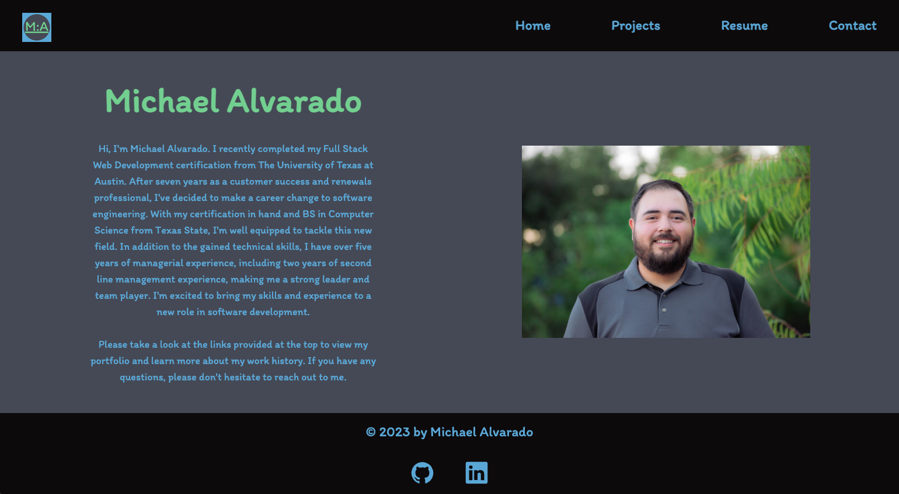

# React-Portfolio

  ## Description
  
  My professional portfolio built using React and TailwindCSS and deployed to Heroku. This portfolio is meant to convey the culmination of skills and knowledge learned while completing my  bootcamp.

  ## Table of Contents
  
  - [Installation](#installation)
  - [Usage](#Usage)
  - [License](#License)
  - [Contributions](#Contributions)
  - [Tests](#Tests)
  - [Questions](#Questions)

  ## Installation
  
  How to install:
  npm install

  ## Usage
  
  Type 'npm run start' in your CLI after cloning this repo. You can also visit the live site at [https://michaelalvarado.vercel.app/](https://michaelalvarado.vercel.app/).
   
   
  

  ## License
  
  

  ## Badges

  
  

  ## Contributions
  
  N/A

  ## Tests
  
  Steps necessary to test:
  N/A

  ## Questions
  
  Feel free to reach out to me if you have any questions. Contact info below:
  - [GitHub](https:://github.com/Michael-Alvarado)
  - Email: alvaradomike5@gmail.com
